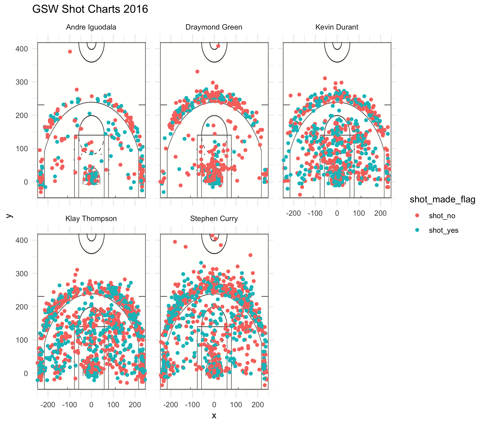

```{r setup, include=FALSE}
knitr::opts_chunk$set(echo = TRUE)
library(dplyr)
```

# Stat 133 Workout 1

## Introduction: 
In this report, we are analyzing shot charts and shooting patterns for 5 NBA players. These five players, Stephen Curry, Andre Iguodala, Klay Thompson, Draymond Green, and Kevin Durant, are the starting five for the Golden State Warriors 2016-2017 team. They won the 2017 NBA Championship, as well as the 2018 championship. Among these 5, there is a rich mixture of shooting, defense, athleticism and playmaking abilities. Because each player is so versatile, they pose a serious threat to any team that they face. Their talents have drawn large crowds to every game for years, and they have one of the loudest arenas in the NBA.

## Images: 
### Here is the starting five:

```{r out.width='80%', fig.align='center', echo=FALSE}
knitr::include_graphics("../images/hampton5.jpg")
```

#### From left to right: Curry, Green, Durant, Thompson, Iguodala.

## Player Information

### Some history about each player:

* Stephen Curry: drafted in 2009, he has been a Warrior since entering the NBA, and holds records for the most Three Pointers made in a season
* Klay Thompson: drafted in 2011 by the warriors. Klay has the record for most three pointers in an NBA game and in a playoff game (14 and 11).
* Kevin Durant: Signed with team in 2016. Durant is the NBA's most versatile scorer, as he is tall, quick, and a great shooter. Not many NBA players possess all three qualities. He is the 2017 and 2018 NBA Finals MVP.
* Draymond Green: A defensive player of the year in 2017, Draymond Green is able to lock down positions 1-5, and focuses his energy on stopping the other team from scoring.
* Andre Iguodala: Signed with team in 2013, Iguodala is the 2015 NBA Finals MVP, leading his team to the championship by defending the best opposing player, LeBron James.

## Effective Shooting Percentages by Player - 2, 3, Overall

```{r runit, comment=""}

andre_data <- read.csv(file = '../data/andre-iguodala.csv', stringsAsFactors = FALSE)
steph_data <- read.csv(file = '../data/stephen-curry.csv', stringsAsFactors = FALSE)
kevin_data <- read.csv(file = '../data/kevin-durant.csv', stringsAsFactors = FALSE)
klay_data <- read.csv(file = '../data/klay-thompson.csv', stringsAsFactors = FALSE)
dray_data <- read.csv(file = '../data/draymond-green.csv', stringsAsFactors = FALSE)
nba_data <- read.csv(file = "../data/nba-players-2018.csv", stringsAsFactors = FALSE)

stacked <- read.csv(file = "../data/shots-data.csv")
stacked <- select(stacked, name, shot_type, shot_made_flag)

#2pts
stacked <- filter(stacked, shot_type == "2PT Field Goal")
stacked$made <- (stacked$shot_made_flag == "shot_yes") + 0
percentages2 <- summarize(group_by(stacked, name), made = sum(made))
shot_attempts = c(nrow(filter(andre_data, shot_type == "2PT Field Goal")), nrow(filter(dray_data, shot_type == "2PT Field Goal")), nrow(filter(kevin_data, shot_type == "2PT Field Goal")), nrow(filter(klay_data, shot_type == "2PT Field Goal")), nrow(filter(steph_data, shot_type == "2PT Field Goal")))
percentages2$attempts <- shot_attempts
percentages2$pct <- percentages2$made / percentages2$attempts
final_2pt_table <- arrange(percentages2, desc(pct))
final_2pt_table

#3pts
stacked <- read.csv(file = "../data/shots-data.csv")
stacked <- filter(stacked, shot_type == "3PT Field Goal")
stacked$made <- (stacked$shot_made_flag == "shot_yes") + 0
#head(stacked)
percentages2 <- summarize(group_by(stacked, name), made = sum(made))
shot_attempts = c(nrow(filter(andre_data, shot_type == "3PT Field Goal")), nrow(filter(dray_data, shot_type == "3PT Field Goal")), nrow(filter(kevin_data, shot_type == "3PT Field Goal")), nrow(filter(klay_data, shot_type == "3PT Field Goal")), nrow(filter(steph_data, shot_type == "3PT Field Goal")))
percentages2$attempts <- shot_attempts
percentages2$pct <- percentages2$made / percentages2$attempts
final_3pt_table <- arrange(percentages2, desc(pct))
(final_3pt_table)
  
#overall
stacked <- read.csv(file = "../data/shots-data.csv")
stacked <- select(stacked, name, shot_type, shot_made_flag)
stacked$made <- (stacked$shot_made_flag == "shot_yes") + 0
head(stacked)
percentages2 <- summarize(group_by(stacked, name), made = sum(made))
shot_attempts = c(nrow(andre_data), nrow(dray_data), nrow(kevin_data), nrow(klay_data), nrow(steph_data))
percentages2$attempts <- shot_attempts
percentages2$pct <- percentages2$made / percentages2$attempts
final_pt_table <- arrange(percentages2, desc(pct))
(final_pt_table)

```

## Faceted Shot Charts (with code)

### Here is some code used to create side-by-side shot charts for the starting 5:

```{r nonrun, eval=FALSE}
stacked <- rbind(andre_data, steph_data, kevin_data, klay_data, dray_data)

faceted <- ggplot(data = stacked) + annotation_custom(court_image, -250, 250, -50, 420) + geom_point(aes(x = x, y = y, color = shot_made_flag)) + ylim(-50, 420) +
  ggtitle("GSW Shot Charts 2016") + theme_minimal() + facet_wrap(vars(name))
```

### And Here is the resulting set of shot charts.

```{r out.width='80%', fig.align='center', echo=FALSE}

```

## Take-home message (shot charts): 
As you can see from the shot charts, we notice who are the best offensive players on the team. Curry, Thompson, and Durant all can shoot from anywhere on the court. Iguodala and Green take far fewer shots, and have a greater proportion of misses. This is not an issue since these two are better known for their defensive prowess.

 
