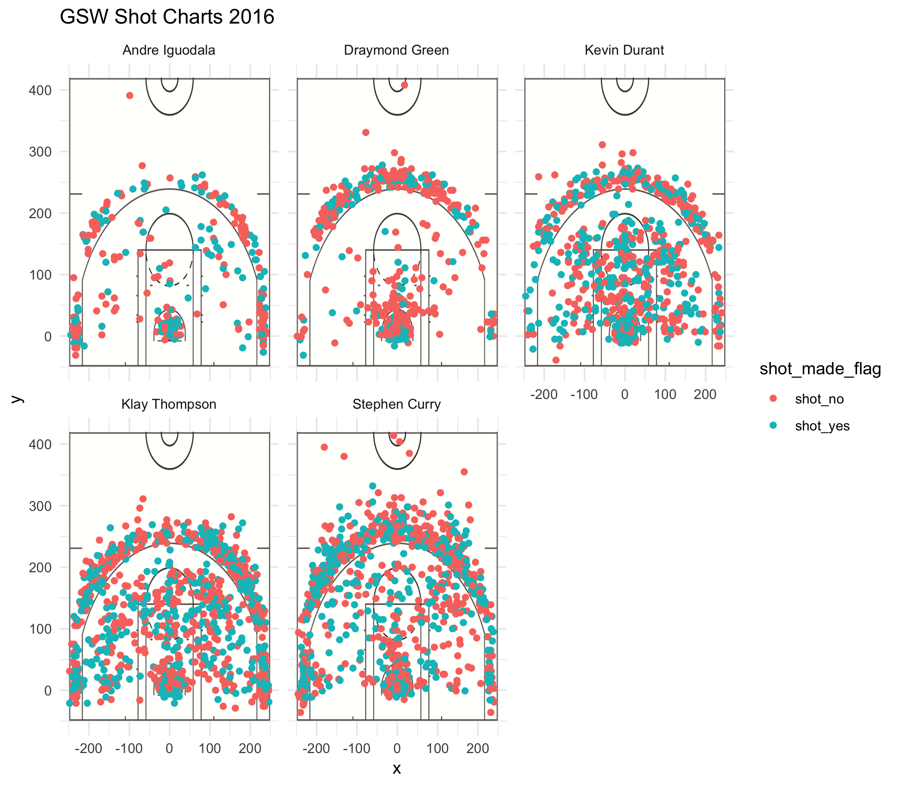

Workout 1
================
Abhishek Sharma
3/8/2019

Stat 133 Workout 1
==================

Introduction:
-------------

In this report, we are analyzing shot charts and shooting patterns for 5 NBA players. These five players, Stephen Curry, Andre Iguodala, Klay Thompson, Draymond Green, and Kevin Durant, are the starting five for the Golden State Warriors 2016-2017 team. They won the 2017 NBA Championship, as well as the 2018 championship. Among these 5, there is a rich mixture of shooting, defense, athleticism and playmaking abilities. Because each player is so versatile, they pose a serious threat to any team that they face. Their talents have drawn large crowds to every game for years, and they have one of the loudest arenas in the NBA. As of now, with the addition of Demarcus Cousins, this team is poised to win the 2019 NBA Championship.

Images:
-------

### Here is the starting five:


#### From left to right: Curry, Green, Durant, Thompson, Iguodala.

Player Information
------------------

### Some history about each player:

-   **Stephen Curry**: Point Guard, drafted in 2009, he has been a Warrior since entering the NBA, and holds records for the most Three Pointers made in a season. He is regarded as the greatest shooter of all time. Since joining the league, Curry has broken his own record for most three pointers in a season twice. He is on track to finish first in NBA history in three pointers made.
-   **Klay Thompson**: Shooting Guard, drafted in 2011 by the warriors. Klay has the record for most three pointers in an NBA game and in a playoff game (14 and 11). Many fans believe he is the second best shooter in the NBA, behind Curry. He is on track to finish second all-time in three pointers made, behind Curry.
-   **Kevin Durant**: Small Forward / Center, Signed with team in 2016. Durant is the NBA's most versatile scorer, as he is tall, quick, and a great shooter. Not many NBA players possess all three qualities. He is the 2017 and 2018 NBA Finals MVP. He holds multiple scoring titles in the NBA, and was the youngest NBA player to lead the league in scoring for a season at age 21. In all of Durant's seasons, he has scored at least 20 points per game. Michael Jordan and LeBron James are the only other two players who have also accomplished this.
-   **Draymond Green**: Power Forward / Center, A defensive player of the year in 2017, Draymond Green is able to lock down positions 1-5, and focuses his energy on stopping the other team from scoring. Though not regarded as a scorer, Draymond will shoot three pointers if left open, and has drawn criticism for continuing to shoot at a relatively low percentage.
-   **Andre Iguodala**: Small Forward, Signed with team in 2013, Iguodala is the 2015 NBA Finals MVP, leading his team to the championship by defending the best opposing player, LeBron James. He is not as great of a shooter as his teammates, but when an opponent needs to be shut down from scoring, Iguodala is who they call in. Although the oldest of the bunch, Andre is also the most athletic of the five, finishing second place in an NBA Dunk contest to Nate Robinson in 2006.

Hypotheses
----------

#### Some expectations about the player stats:

-   We can expect to see solid shot charts for Curry, Thompson, and Durant.
-   Iguodala and Green will have less populated shot charts.

Effective Shooting Percentages by Player - 2, 3, Overall
--------------------------------------------------------

``` r
andre_data <- read.csv(file = '../data/andre-iguodala.csv', stringsAsFactors = FALSE)
steph_data <- read.csv(file = '../data/stephen-curry.csv', stringsAsFactors = FALSE)
kevin_data <- read.csv(file = '../data/kevin-durant.csv', stringsAsFactors = FALSE)
klay_data <- read.csv(file = '../data/klay-thompson.csv', stringsAsFactors = FALSE)
dray_data <- read.csv(file = '../data/draymond-green.csv', stringsAsFactors = FALSE)
nba_data <- read.csv(file = "../data/nba-players-2018.csv", stringsAsFactors = FALSE)

stacked <- read.csv(file = "../data/shots-data.csv")
stacked <- select(stacked, name, shot_type, shot_made_flag)

#2pts
stacked <- filter(stacked, shot_type == "2PT Field Goal")
stacked$made <- (stacked$shot_made_flag == "shot_yes") + 0
percentages2 <- summarize(group_by(stacked, name), made = sum(made))
shot_attempts = c(nrow(filter(andre_data, shot_type == "2PT Field Goal")), nrow(filter(dray_data, shot_type == "2PT Field Goal")), nrow(filter(kevin_data, shot_type == "2PT Field Goal")), nrow(filter(klay_data, shot_type == "2PT Field Goal")), nrow(filter(steph_data, shot_type == "2PT Field Goal")))
percentages2$attempts <- shot_attempts
percentages2$pct <- percentages2$made / percentages2$attempts
final_2pt_table <- arrange(percentages2, desc(pct))
final_2pt_table
```

    # A tibble: 5 x 4
      name            made attempts   pct
      <fct>          <dbl>    <int> <dbl>
    1 Andre Iguodala   134      210 0.638
    2 Kevin Durant     390      643 0.607
    3 Stephen Curry    304      563 0.540
    4 Klay Thompson    329      640 0.514
    5 Draymond Green   171      346 0.494

``` r
#3pts
stacked <- read.csv(file = "../data/shots-data.csv")
stacked <- filter(stacked, shot_type == "3PT Field Goal")
stacked$made <- (stacked$shot_made_flag == "shot_yes") + 0
#head(stacked)
percentages2 <- summarize(group_by(stacked, name), made = sum(made))
shot_attempts = c(nrow(filter(andre_data, shot_type == "3PT Field Goal")), nrow(filter(dray_data, shot_type == "3PT Field Goal")), nrow(filter(kevin_data, shot_type == "3PT Field Goal")), nrow(filter(klay_data, shot_type == "3PT Field Goal")), nrow(filter(steph_data, shot_type == "3PT Field Goal")))
percentages2$attempts <- shot_attempts
percentages2$pct <- percentages2$made / percentages2$attempts
final_3pt_table <- arrange(percentages2, desc(pct))
(final_3pt_table)
```

    # A tibble: 5 x 4
      name            made attempts   pct
      <fct>          <dbl>    <int> <dbl>
    1 Klay Thompson    246      580 0.424
    2 Stephen Curry    280      687 0.408
    3 Kevin Durant     105      272 0.386
    4 Andre Iguodala    58      161 0.360
    5 Draymond Green    74      232 0.319

``` r
#overall
stacked <- read.csv(file = "../data/shots-data.csv")
stacked <- select(stacked, name, shot_type, shot_made_flag)
stacked$made <- (stacked$shot_made_flag == "shot_yes") + 0
percentages2 <- summarize(group_by(stacked, name), made = sum(made))
shot_attempts = c(nrow(andre_data), nrow(dray_data), nrow(kevin_data), nrow(klay_data), nrow(steph_data))
percentages2$attempts <- shot_attempts
percentages2$pct <- percentages2$made / percentages2$attempts
final_pt_table <- arrange(percentages2, desc(pct))
(final_pt_table)
```

    # A tibble: 5 x 4
      name            made attempts   pct
      <fct>          <dbl>    <int> <dbl>
    1 Kevin Durant     495      915 0.541
    2 Andre Iguodala   192      371 0.518
    3 Klay Thompson    575     1220 0.471
    4 Stephen Curry    584     1250 0.467
    5 Draymond Green   245      578 0.424

Faceted Shot Charts (with code)
-------------------------------

### Here is some code used to create side-by-side shot charts for the starting 5:

``` r
stacked <- rbind(andre_data, steph_data, kevin_data, klay_data, dray_data)

faceted <- ggplot(data = stacked) + annotation_custom(court_image, -250, 250, -50, 420) + geom_point(aes(x = x, y = y, color = shot_made_flag)) + ylim(-50, 420) +
  ggtitle("GSW Shot Charts 2016") + theme_minimal() + facet_wrap(vars(name))
```

### And Here is the resulting set of shot charts.



Take-home message (shot charts):
--------------------------------

As you can see from the shot charts, we notice who are the best offensive players on the team. Curry, Thompson, and Durant all can shoot from anywhere on the court. Iguodala and Green take far fewer shots, and have a greater proportion of misses. This is not an issue since these two are better known for their defensive prowess. The shot charts confirm what we initially knew about the players. Durant, being the most versatile scorer, has the most dispersed shot chart. Curry and Thompson have the most attempts from beyond three point range.
